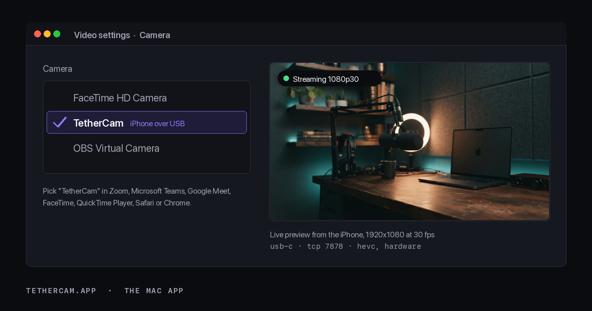
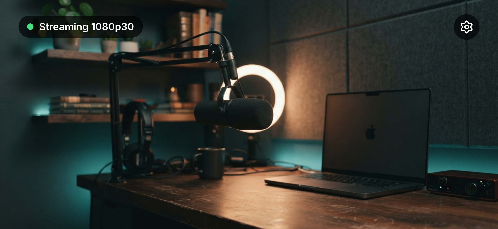
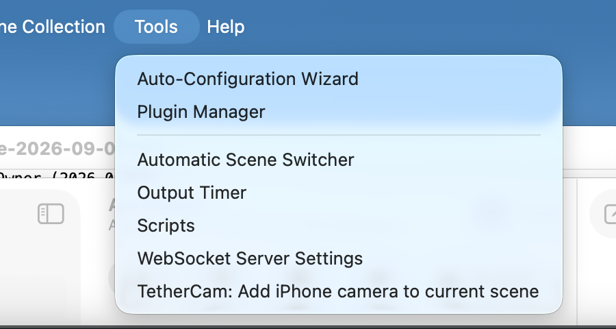
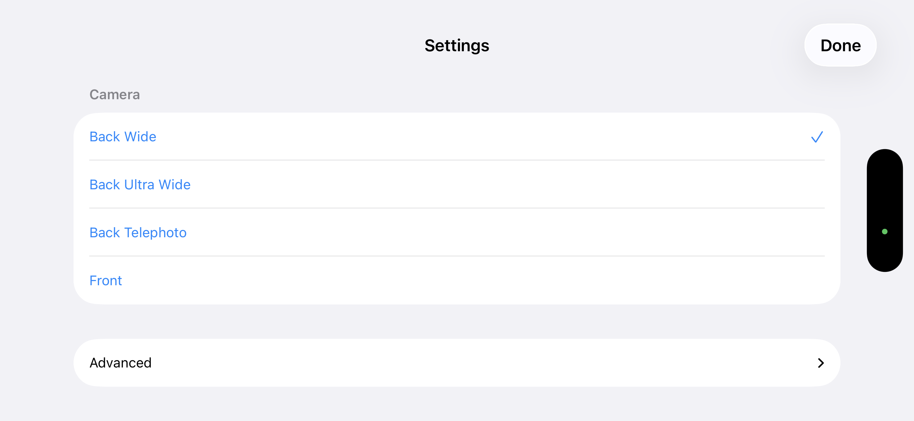
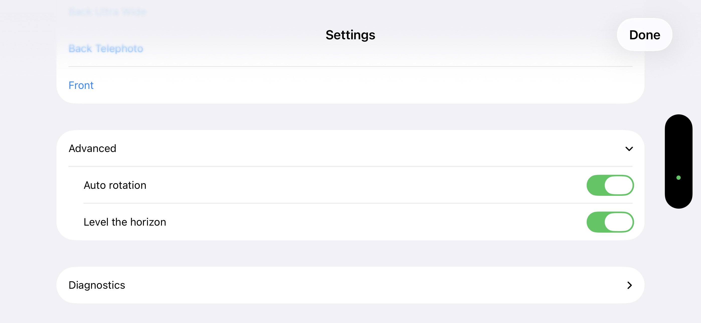
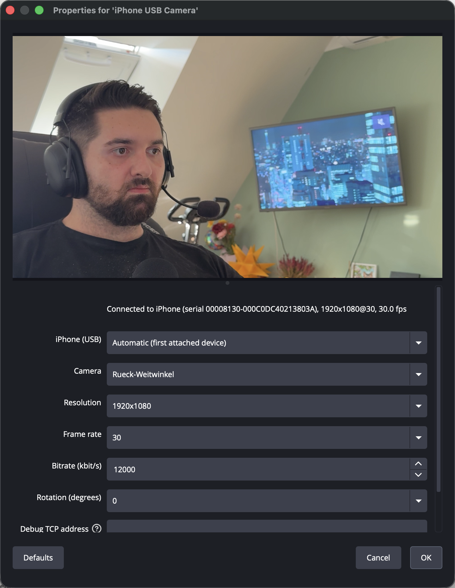
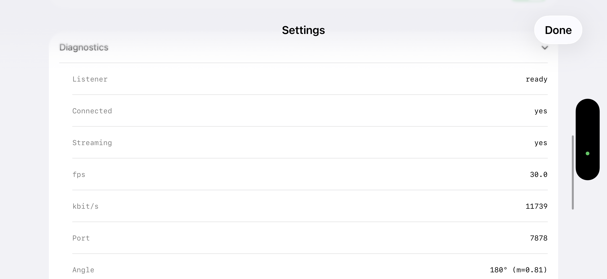

# TetherCam

**Your iPhone, instead of a webcam. Two free apps, one USB cable.**

Use your iPhone for calls and recordings on your Mac. Choose **TetherCam** in Zoom,
Teams, Meet or FaceTime. No Wi-Fi, cloud or account.

**[Download for Mac](https://github.com/Kanevry/tethercam/releases/latest/download/TetherCam-mac.dmg)**
(macOS 14+, signed and notarized) · **[Get the iPhone app](https://apps.apple.com/us/app/tethercam/id6808997521)**
(iOS 17+). You need both apps and one camera-extension approval on the Mac.

Recording or streaming in OBS? The [OBS plugin](#b-obs-studio-the-plugin-the-pro-path)
replaces the Mac app and brings the phone's microphone into the OBS mixer. It needs
macOS 12+ and OBS Studio 30+. [Setup and troubleshooting](https://tethercam.app/install).

[](https://github.com/Kanevry/tethercam/actions/workflows/ci-plugin.yml)
[](https://github.com/Kanevry/tethercam/releases/latest)
[](#license)
[](https://tethercam.app)
[](https://apps.apple.com/us/app/tethercam/id6808997521)

<br clear="left">



*The default path: the iPhone is just another camera called "TetherCam" in Zoom, Teams, Google Meet or FaceTime. Schematic of the picker; the preview is a generated studio scene.*


*Live 1080p from an iPhone 15 Pro Max, decoded in OBS. The stream never leaves the cable.*

## Quick start

Two apps, about five minutes. TetherCam for iPhone captures, TetherCam for Mac publishes the
picture as the system camera "TetherCam". In OBS Studio the plugin takes the Mac app's place.
Run one receiver at a time: the phone serves a single connection, and the second one gets `BUSY`.

### A. The two apps: Zoom, Teams, Meet, FaceTime and every other Mac app

**1. Get the iPhone app.** Free on the App Store: **[https://apps.apple.com/us/app/tethercam/id6808997521](https://apps.apple.com/us/app/tethercam/id6808997521)** (iOS 17+). Open it and plug the phone into the Mac with a data cable; the first time, tap **Trust**.

**2. Install the Mac app.**

```sh
brew tap kanevry/tethercam
brew install --cask tethercam
```

Prefer a click? Download [`TetherCam-mac.dmg`](https://github.com/Kanevry/tethercam/releases/latest/download/TetherCam-mac.dmg) and **drag TetherCam into Applications with Finder**, then open it. It lives in the menu bar and has no window. macOS asks once to allow the camera extension: **System Settings > General > Login Items & Extensions > Camera Extensions > enable TetherCam** (admin password once).

**3. Pick the camera `TetherCam`** in Zoom, Microsoft Teams, Google Meet, FaceTime, QuickTime Player, Photo Booth, Safari, Chrome or any other app that lists system cameras. Keep the phone app in the foreground. Details: [Zoom, Meet, FaceTime and every other Mac app](#zoom-meet-facetime-and-every-other-mac-app-the-tethercam-virtual-camera).

Video only on this path. Select your microphone separately in the call. For the iPhone microphone in OBS recordings and streams, use path B.

### B. OBS Studio (the plugin, the pro path)

**1. Install the OBS plugin, then restart OBS.**

From v0.1.0 on:

```sh
curl -fsSL https://raw.githubusercontent.com/Kanevry/tethercam/main/scripts/install.sh | bash
```

Prefer a click? Download `TetherCam-obs-plugin.pkg` from [Releases](https://github.com/Kanevry/tethercam/releases/latest) and open it. It installs into your own home, nothing system wide. Prefer to build from source? See [Install the Mac plugin](#install-the-mac-plugin).

**2. Get the iPhone app.**

<!-- TESTFLIGHT: public link, external group "Public Beta" -->
Free on the App Store: **[https://apps.apple.com/us/app/tethercam/id6808997521](https://apps.apple.com/us/app/tethercam/id6808997521)** (iOS 17+, released 2026-09-09). Early builds go to the public TestFlight beta [https://testflight.apple.com/join/wmT74Ry8](https://testflight.apple.com/join/wmT74Ry8) before they reach the store. Or build it yourself with a free Apple ID, five minutes: [Install the iPhone app](#install-the-iphone-app).



**3. In OBS: Tools, then "TetherCam: Add iPhone camera to current scene".**

The menu entry creates the source, names it `TetherCam iPhone` and fits it to your canvas. Then plug the phone in, open TetherCam on it and leave it in the foreground. The status line on the phone turns green and says `Streaming 1080p30`.



There is no pairing, no code to type and no network setup. If the picture stays black, the source properties carry a status line at the top that says which of the three steps is missing. Since 0.2.0 the phone's microphone travels on the same cable and lands in the OBS audio mixer.

## Why

Continuity Camera stopped working after an iOS and macOS version mismatch (iOS 26.6 on a Mac with macOS 26.5). The handshake succeeds, the picture stays black, the log says `invalid stream for ContinuityCaptureControl`. I wanted a small, open-source tool I could inspect and fix for my own recording setup.

I built a separate connection: the phone encodes HEVC in hardware and serves it on a local TCP port, the Mac reaches that port through the system USB multiplexer, and an OBS plugin decodes it with VideoToolbox.

Measured on the development machine (iPhone 15 Pro Max, M4 Pro, OBS 32.2.2):

| What | Value |
|---|---|
| Resolutions | 1080p30 and 1080p60 |
| Bitrate | about 13 Mbit/s HEVC |
| Ping round trip over USB | about 1 ms |
| Decoder setup to first frame | about 90 ms |
| Reconnect after cable pull | about 1.3 s |
| 3 minute run | 30.0 fps, about 6 percent CPU |

These transport and startup measurements are from one setup. They do not measure end-to-end camera latency, which has not been measured here.

## How it works


- The iOS app captures with AVCaptureSession and encodes HEVC in hardware, realtime mode, no frame reordering.
- The app is a TCP server on port 7878. That port is only reachable locally and through the cable, never over Wi-Fi.
- The Mac talks to `/var/run/usbmuxd`, asks for the device list, filters hard on `ConnectionType == "USB"`, and opens a tunnel to port 7878.
- Both sides speak IUCM, a 12 byte header plus payload. Video frames carry length prefixed VCL NAL units, parameter sets travel once in a `hvcC` record.
- The plugin decodes with VideoToolbox and hands NV12 BT.709 frames straight to OBS. It does not buffer.

The wire format is documented well enough to write your own receiver: [protocol/PROTOCOL.md](protocol/PROTOCOL.md). Deeper design notes: [docs/ARCHITECTURE.md](docs/ARCHITECTURE.md).

## Requirements

- iPhone XR or newer with iOS 17 or later. Tested on iPhone 15 Pro Max, iOS 26.6.1.
- Mac with macOS 12 or later (macOS 14 or later for the Mac app with the camera extension). Tested on macOS 26.5.2, Apple Silicon.
- OBS Studio 30 or later, **only for path B**, the plugin. Tested with 32.2.2.
- To build the iOS app yourself: Xcode 16 or later (tested with 26.0.1) and a free Apple ID, plus `xcodegen`.
- To build the plugin: CMake 3.28 or later and the Xcode command line tools.

## Zoom, Meet, FaceTime and every other Mac app: the TetherCam virtual camera

**Your iPhone in every Mac app, no OBS involved.** `TetherCam-mac.dmg` is a free menu bar app that embeds a CoreMediaIO Camera Extension. It receives the same USB stream the OBS plugin does and publishes it as the system camera "TetherCam" (1920x1080, 30 fps), so Zoom, Teams, Google Meet, FaceTime, QuickTime and ffmpeg see the iPhone like any webcam.

**[Download TetherCam-mac.dmg](https://github.com/Kanevry/tethercam/releases/latest/download/TetherCam-mac.dmg)** &middot; version 0.3.0, Developer ID signed, notarized and stapled &middot; macOS 14 or newer, Apple silicon and Intel &middot; free, MIT. The checksum is next to it as [`TetherCam-mac.dmg.sha256`](https://github.com/Kanevry/tethercam/releases/latest/download/TetherCam-mac.dmg.sha256).

### Five steps

1. Install **TetherCam** on the iPhone from the [App Store](https://apps.apple.com/us/app/tethercam/id6808997521) and open it.
2. Plug the iPhone into the Mac with the USB cable. The first time, tap **Trust** on the phone.
3. Download `TetherCam-mac.dmg`, **drag TetherCam into Applications with Finder**, then open it. It lives in the menu bar and has no window.
4. macOS asks once to allow the camera extension: **System Settings > General > Login Items & Extensions > Camera Extensions > enable TetherCam** (admin password once). The menu bar app has a button that opens exactly that pane.
5. In any app, pick the camera **TetherCam**. That is it; the camera reconnects by itself when the phone app is restarted.

Alternative install path, same signed app:

```sh
brew tap kanevry/tethercam
brew install --cask tethercam
```

### Where to pick the camera

| App | Where |
|---|---|
| Zoom | camera menu (video arrow, "Select a Camera") |
| Google Meet | arrow next to the camera button |
| FaceTime | Video menu |
| QuickTime Player | New Movie Recording, arrow next to the record button |
| Photo Booth | Camera menu |
| Safari and Chrome | the site's own camera picker, or the camera icon in the address bar |
| Microsoft Teams | Settings > Devices |
| Anything else that lists system cameras (Webex, Slack, Discord) | its own camera or video settings |

**Verified with a real iPhone 15 Pro Max** in QuickTime Player, Photo Booth, FaceTime, Google Meet in Chrome, Safari, Chrome and ffmpeg (2026-09-09) and in Zoom 7.1.5 and Microsoft Teams (2026-09-10). Other apps with a system-camera picker, such as Webex, Slack and Discord, are expected to work; I have not tested them individually.

### Limits

- **Video only.** A macOS camera extension cannot carry audio. For sound in a call, use the phone's microphone via Continuity or the Mac microphone; for audio *and* video together, use the OBS plugin.
- **One receiver at a time.** The phone serves one connection: run either the Mac app or the OBS plugin source, not both. The second one reports BUSY.
- **Fixed output format.** 1920x1080 at 30 fps. A portrait phone is pillarboxed into that frame.

### Troubleshooting

| Symptom | Fix |
|---|---|
| The menu says "Error: TetherCam.app must be in /Applications" although it is there | The app was copied by something other than Finder while it still carried the quarantine flag, so macOS App Translocation runs it from a random read-only path. Drag it into `/Applications` with **Finder**, or run `xattr -dr com.apple.quarantine /Applications/TetherCam.app` and open it again |
| The camera "TetherCam" does not appear in any app | The extension is not enabled yet. System Settings > General > Login Items & Extensions > Camera Extensions > enable TetherCam, then quit (Cmd-Q) and reopen the app that should show the camera |
| Extension enabled, app reopened, still no "TetherCam" in Zoom or Teams | Restart the Mac. macOS finishes registering a newly installed or updated camera extension only at the next boot; Zoom 7.1 and Teams listed the camera right after the restart |
| The picture stays black and the menu says BUSY | Another receiver already holds the phone. Close the OBS TetherCam source (or the other app) first |
| Nothing happens after plugging the phone in | Open TetherCam on the phone and leave it in the foreground; iOS suspends the listener in the background |
| The camera list in an app is stale | Camera lists are read at app launch. Quit and reopen that app |

**Instead of the Mac app, via OBS:** choose **Start Virtual Camera** (Controls dock). The TetherCam picture then appears as the camera "OBS Virtual Camera". The phone's audio reaches the OBS mixer for recordings and streams. OBS Virtual Camera carries video only; choose a separate microphone in your call app.

Build it yourself (Xcode 16 or later, `xcodegen`, an Apple Development signing identity):

```sh
cd mac-app && xcodegen generate
bash scripts/install-local.sh    # builds Release, copies to /Applications, launches once
```

Details, headless flags and the end to end check without a phone (`bash tools/vcam-test.sh`) are in [mac-app/README.md](mac-app/README.md). Design, status and open risks: [docs/superpowers/specs/2026-09-09-virtual-camera-cmio.md](docs/superpowers/specs/2026-09-09-virtual-camera-cmio.md).

## Install the Mac plugin

### Option A: release bundle

From v0.1.0 on, `TetherCam-obs-plugin.pkg` is on [Releases](https://github.com/Kanevry/tethercam/releases/latest). It is signed with a Developer ID Installer certificate and notarized by Apple, so macOS opens it without a warning. It installs into your own home, no admin rights needed.

### Option B: build from source

```sh
git clone https://github.com/Kanevry/tethercam.git
cd tethercam/obs-plugin
CI=1 cmake --preset macos
cmake --build --preset macos
```

`CI=1` is required. Without it the first configure step aborts in `cmake/common/buildnumber.cmake`. That is a quirk of the upstream obs-plugintemplate, not of this repo. Alternatively pass `-DPLUGIN_BUILD_NUMBER=1`.

The first configure downloads libobs sources and the OBS dependency bundle into `.deps/`, about 1 GB. That happens once.

Install the result and restart OBS:

```sh
cp -R build_macos/RelWithDebInfo/obs-iphone-usb-cam.plugin \
      ~/Library/Application\ Support/obs-studio/plugins/
```

To confirm it loaded, open the newest log under `~/Library/Application Support/obs-studio/logs/` and look for `obs-iphone-usb-cam` under `Loaded Modules:`.

### Option C: Homebrew

```sh
brew tap kanevry/tethercam
brew install --cask tethercam-obs
```

The cask copies the signed bundle straight into your own
`~/Library/Application Support/obs-studio/plugins/` folder, the same place Option A
and the one-line installer put it. No admin rights needed.

## Install the iPhone app

<a id="testflight-link"></a>
**Easiest way: install TetherCam from the App Store** at [https://apps.apple.com/us/app/tethercam/id6808997521](https://apps.apple.com/us/app/tethercam/id6808997521). The current App Store version is 0.2.0, with microphone audio for OBS and double-tap camera switching (verified 2026-09-10). It needs iOS 17 or newer. Pre-release builds go to the free public TestFlight beta at [https://testflight.apple.com/join/wmT74Ry8](https://testflight.apple.com/join/wmT74Ry8) first. Install TestFlight from the App Store if you do not have it; the link is open to anyone.

The prebuilt iPhone app is distributed through the App Store and TestFlight; this repository does not publish an `.ipa` download. If you would rather not use the App Store or TestFlight, or want to change the code, build and install the app yourself. That is free with any Apple ID, and the resulting build expires after 7 days unless you have a paid developer account.

The full install guide, including troubleshooting, is at [tethercam.app/install](https://tethercam.app/install).

```sh
brew install xcodegen
cd ios-app
xcodegen generate
open TetherCam.xcodeproj
```

In Xcode, select the `TetherCam` target, go to Signing and Capabilities, and set your own Team. Change `PRODUCT_BUNDLE_IDENTIFIER` to something unique to you (for example `com.yourname.tethercam`), otherwise signing fails on a bundle ID that is already taken.

On the phone, enable Developer Mode under Settings, Privacy and Security, Developer Mode, then restart the phone. Without this step installation fails even when the build succeeded.

Then build and run to the connected device from Xcode. Or from the command line:

```sh
xcodebuild -project TetherCam.xcodeproj -scheme TetherCam \
  -destination 'generic/platform=iOS' \
  -allowProvisioningUpdates -derivedDataPath build build

xcrun devicectl list devices
xcrun devicectl device install app --device <UDID> \
  build/Build/Products/Debug-iphoneos/TetherCam.app
xcrun devicectl device process launch --device <UDID> at.gotzendorfer.tethercam
```

More detail: [ios-app/README.md](ios-app/README.md).

## Usage

1. Connect the iPhone to the Mac with a cable and unlock it.
2. Open TetherCam on the phone and leave it in the foreground. iOS suspends the listener as soon as the app goes to the background, so the app keeps the screen on while streaming. Tap the gear icon to open the settings sheet and pick camera, lens and resolution before you start OBS.
3. In OBS: **Tools -> "TetherCam: Add iPhone camera to current scene"**. That creates a source named `TetherCam iPhone` in the current scene and fits it to the canvas. If a TetherCam source is already in the scene, the entry does nothing rather than adding a second one. The manual route still works: **Sources -> + -> TetherCam (iPhone via USB)**.
4. The defaults are the ones that work: automatic device, back wide camera, 1920x1080, 30 fps, 12000 kbit/s, no rotation. Changing any property reconnects immediately.





The source properties are:

| Property | Meaning |
|---|---|
| Status | Read-only. Says whether a phone is attached, whether the app is in the foreground, and the live format and frame rate once it streams. Refreshed each time the dialog is opened |
| iPhone (USB) | Device list from usbmuxd, USB only. Empty means the first attached device. Entries are labelled with the serial number, because iOS shortens the reported device name to "iPhone" |
| Camera | Back Wide, Back Ultra Wide, Back Tele, Front. Replaced by the real camera list once the phone has said HELLO |
| Resolution | 1280x720 or 1920x1080 |
| Frame rate | 30 or 60 |
| Bitrate | kbit/s, default 12000 |
| Rotation | 0, 90, 180 or 270 degrees, applied on the Mac side without re-encoding |
| Debug TCP address | Advanced. `host:port` bypasses usbmuxd and connects over plain TCP, used with the simulator |

### Troubleshooting

Open the source's Properties dialog first. The status line at the top says which step is missing, before you read the table below.



The app's own gear icon has a matching Diagnostics sheet, useful when the phone side is the unknown: listener ready, connected yes/no, streaming yes/no, live fps and kbit/s, the port in use, the current angle and the residual after levelling.



| Symptom | Likely cause |
|---|---|
| Black source, no log lines | TetherCam is not in the foreground on the phone, or the phone is locked |
| Black source with plugin 0.2.0 and the App Store app 0.1.0 | Fixed in plugin 0.2.1: 0.2.0 asked for audio in a way the 1.0 app dropped silently. Update the plugin (`brew upgrade --cask tethercam-obs`, or the new `.pkg`) and update the phone app from the App Store (0.2.0 or newer) |
| Nothing in the device list | Cable is charge only, phone not trusted, or Developer Mode is off |
| `ERROR 1 BUSY` in the OBS log | Another receiver is already connected. Only one receiver per phone. Close the other OBS source or the CLI receiver |
| Picture sideways or upside down | The app follows the phone orientation automatically (Auto-Rotation, on by default). Lying flat on a table there is no horizon, so mount the phone first. Override with the manual 0/90/180/270 picker in the app or the Rotation setting in the OBS source |
| Colors look washed out or tinted | Something in the chain is not on BT.709 video range. The convention is fixed, see PROTOCOL.md section 4.6 |
| Connection drops every few seconds | The Mac stopped sending PING, or the cable is flaky. Three missed PONGs, about 6 s, force a reconnect |

## Development

Development happens on GitHub (`Kanevry/tethercam`): issues, pull requests and releases live there.

| Path | Contents |
|---|---|
| `ios-app/` | Swift 6 / SwiftUI capture app, generated Xcode project (MIT) |
| `obs-plugin/` | OBS source plugin, C and Objective-C++ (GPL-2.0-or-later) |
| `mac-app/` | macOS menu bar app plus CoreMediaIO Camera Extension, the virtual camera (MIT, released since 0.2.1) |
| `shared/` | Pure C11 core: IUCM frame parser and usbmuxd client, no Apple frameworks (MIT) |
| `tools/` | Swift package: protocol codec, sender simulator, CLI receiver (MIT) |
| `protocol/` | The normative wire protocol spec |
| `docs/` | Architecture notes, design spec, images |

Tests per component:

```sh
# C core, builds and runs on macOS and Linux
cmake -S shared -B shared/build && cmake --build shared/build
ctest --test-dir shared/build --output-on-failure

# Swift tools
swift test --package-path tools

# End to end without a phone: simulator plus CLI receiver plus ffmpeg check
bash tools/integration.sh

# iOS unit tests, no device and no camera needed (or any available simulator,
# e.g. UsbCam-Test-iPhone17 on the maintainer machine)
cd ios-app && xcodebuild test -project TetherCam.xcodeproj -scheme TetherCam \
  -destination 'platform=iOS Simulator,name=iPhone 17'
```

You can develop the whole Mac side without a phone. Run the simulator and point the plugin at it with the Debug TCP field:

```sh
swift build -c release --package-path tools
./tools/.build/release/usbcam-sim --port 7878
# then set Debug TCP address to 127.0.0.1:7878 in the OBS source
```


*Same source, fed by `usbcam-sim` over plain TCP. No phone involved.*

## Roadmap

- Signed and notarized plugin releases: done since 0.1.0.
- Audio from the phone: shipped in 0.2.0 (AAC-LC over the same cable, mute switch in the app).
- Virtual camera as a macOS Camera Extension (CMIO), so the picture also shows up in Zoom, FaceTime and Safari: released in 0.2.1 as the signed and notarized `TetherCam-mac.dmg`. See [the virtual camera section](#zoom-meet-facetime-and-every-other-mac-app-the-tethercam-virtual-camera). A Mac App Store listing is a separate, open idea ([#15](https://github.com/Kanevry/tethercam/issues/15)).
- Receivers for Windows and Linux. The C core already builds there.
- App Store listing: 0.2.0 available, verified 2026-09-10; public TestFlight beta also available.

## License

- `obs-plugin/`: GPL-2.0-or-later, because it links against libobs.
- Everything else (`shared/`, `ios-app/`, `mac-app/`, `tools/`, `protocol/`, `docs/`): MIT.

## Support the project

TetherCam is free and open source. If it saved you a cable hunt, you can [buy me a coffee via PayPal](https://paypal.me/Kanevry). Bug reports and pull requests are just as welcome.

## Credits

- The OBS Project, for OBS Studio and the [obs-plugintemplate](https://github.com/obsproject/obs-plugintemplate) this plugin is built from.
- Apple, for VideoToolbox and the usbmuxd tunnel that makes the cable path possible.

---

Kurz auf Deutsch: Dieses Projekt bringt das iPhone-Kamerabild ueber das USB-Kabel in OBS, ohne Continuity Camera, ohne WLAN und ohne Cloud. Website und Downloads: https://tethercam.app. Die Dokumentation ist auf Englisch, die Detaildokumente unter `protocol/`, `ios-app/`, `obs-plugin/` und `tools/` sind auf Deutsch. Fragen und Fehlerberichte bitte als Issue auf GitHub. Deutsch: https://tethercam.app/de/.
