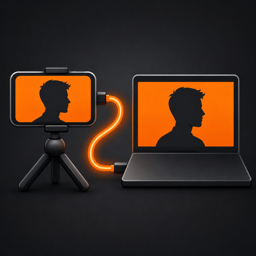
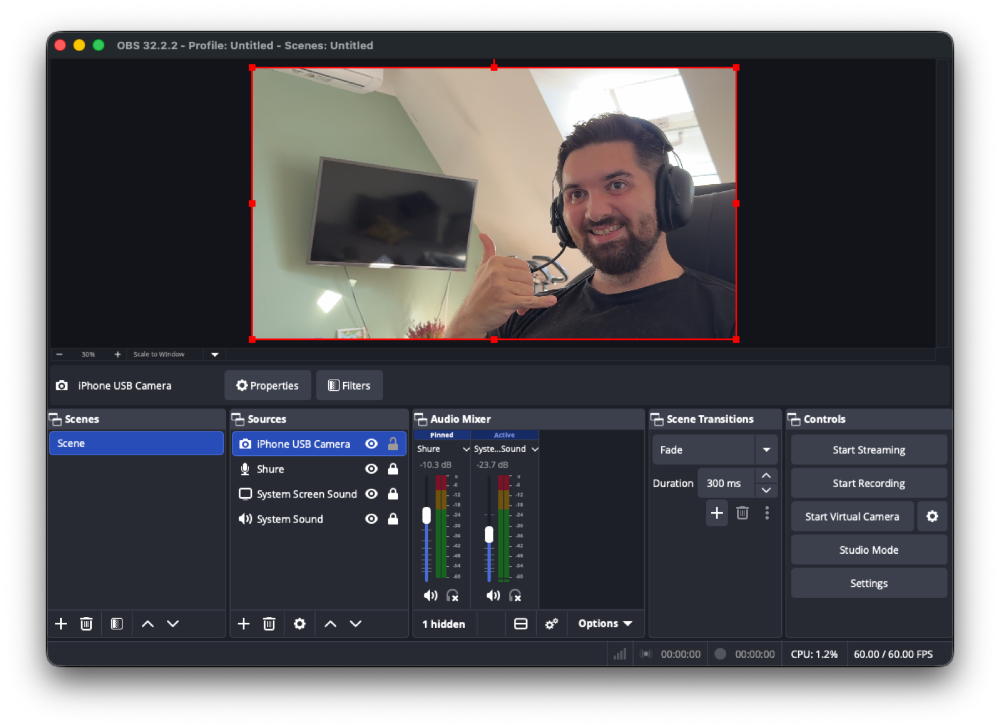
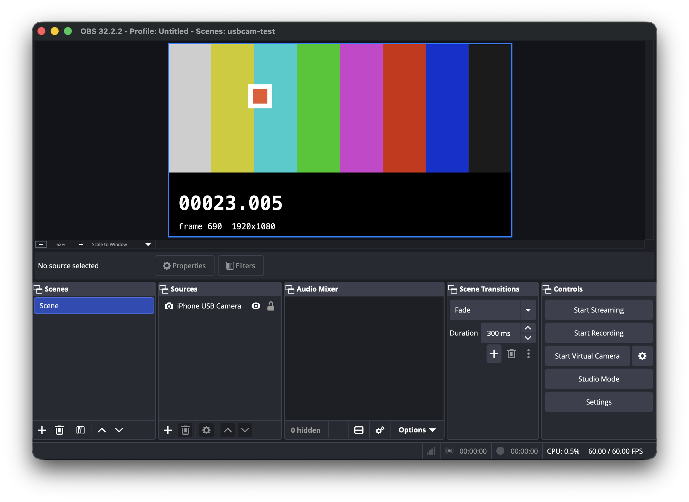
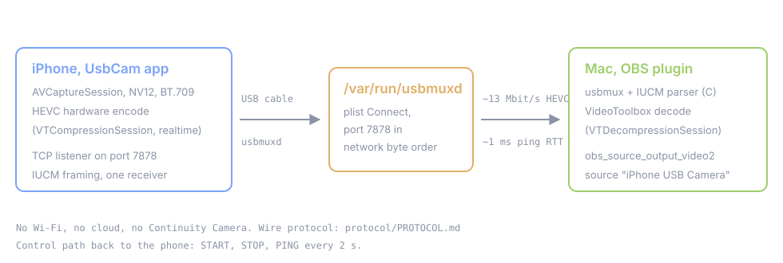

# TetherCam

iPhone camera into OBS over the USB cable. No Continuity Camera, no Wi-Fi, no cloud, open source.

<br clear="left">



*Live 1080p from an iPhone 15 Pro Max, decoded in OBS. The stream never leaves the cable.*

## Quick start

Three steps, about five minutes. The long version of each is further down.

**1. Install the OBS plugin, then restart OBS.**

```sh
curl -fsSL https://raw.githubusercontent.com/Kanevry/tethercam/main/scripts/install.sh | bash
```

Prefer a click? Download `TetherCam-obs-plugin.pkg` from [Releases](https://github.com/Kanevry/tethercam/releases) and open it. It installs into your own home, nothing system-wide. Details and the build-from-source path: [Install the Mac plugin](#install-the-mac-plugin).


**2. Get the iPhone app.**

TestFlight: `TESTFLIGHT_URL` *(placeholder, no public build yet)*. Until then you build it yourself with a free Apple ID, which takes one `xcodegen generate` and one Xcode run: [Install the iPhone app](#install-the-iphone-app).



**3. In OBS: Tools, then "TetherCam: Add iPhone camera to current scene".**

The menu entry creates the source, names it `TetherCam iPhone` and fits it to your canvas. Then plug the phone in, open TetherCam on it and leave it in the foreground. The status line on the phone turns green and says `Streaming 1080p30`.


There is no pairing, no code to type and no network setup. If the picture stays black, the source properties carry a status line at the top that says which of the three steps is missing.

## Why

Continuity Camera stopped working after an iOS and macOS version mismatch (iOS 26.6 on a Mac with macOS 26.5). The handshake succeeds, the picture stays black, the log says `invalid stream for ContinuityCaptureControl`. The existing third party apps are paid and closed source.

So this repo does the boring, verifiable thing: the phone encodes HEVC in hardware and serves it on a local TCP port, the Mac reaches that port through the system USB multiplexer, and an OBS plugin decodes it with VideoToolbox.

Measured on the development machine (iPhone 15 Pro Max, M4 Pro, OBS 32.2.2):

| What | Value |
|---|---|
| Resolutions | 1080p30 and 1080p60 |
| Bitrate | about 13 Mbit/s HEVC |
| Ping round trip over USB | about 1 ms |
| Decoder setup to first frame | about 90 ms |
| Reconnect after cable pull | about 1.3 s |
| 3 minute run | 30.0 fps, about 6 percent CPU |

Your numbers will differ with phone, Mac and settings. These are what this setup did, not a promise.

## How it works



- The iOS app captures with AVCaptureSession and encodes HEVC in hardware, realtime mode, no frame reordering.
- The app is a TCP server on port 7878. That port is only reachable locally and through the cable, never over Wi-Fi.
- The Mac talks to `/var/run/usbmuxd`, asks for the device list, filters hard on `ConnectionType == "USB"`, and opens a tunnel to port 7878.
- Both sides speak IUCM, a 12 byte header plus payload. Video frames carry length prefixed VCL NAL units, parameter sets travel once in a `hvcC` record.
- The plugin decodes with VideoToolbox and hands NV12 BT.709 frames straight to OBS. It does not buffer.

The wire format is documented well enough to write your own receiver: [protocol/PROTOCOL.md](protocol/PROTOCOL.md). Deeper design notes: [docs/ARCHITECTURE.md](docs/ARCHITECTURE.md).

## Requirements

- iPhone XR or newer with iOS 17 or later. Tested on iPhone 15 Pro Max, iOS 26.6.1.
- Mac with macOS 12 or later. Tested on macOS 26.5.2, Apple Silicon.
- OBS Studio 30 or later. Tested with 32.2.2.
- To build the iOS app yourself: Xcode 16 or later (tested with 26.0.1) and a free Apple ID, plus `xcodegen`.
- To build the plugin: CMake 3.28 or later and the Xcode command line tools.

## Install the Mac plugin

### Option A: release bundle

Prebuilt bundles will appear under Releases. They are not signed and notarized yet, so for now build from source.

### Option B: build from source

```sh
git clone https://gitlab.gotzendorfer.at/agents/obs-iphone-usb-cam.git
cd obs-iphone-usb-cam/obs-plugin
CI=1 cmake --preset macos
cmake --build --preset macos
```

`CI=1` is required. Without it the first configure step aborts in `cmake/common/buildnumber.cmake`. That is a quirk of the upstream obs-plugintemplate, not of this repo. Alternatively pass `-DPLUGIN_BUILD_NUMBER=1`.

The first configure downloads libobs sources and the OBS dependency bundle into `.deps/`, about 1 GB. That happens once.

Install the result and restart OBS:

```sh
cp -R build_macos/RelWithDebInfo/obs-iphone-usb-cam.plugin \
      ~/Library/Application\ Support/obs-studio/plugins/
```

To confirm it loaded, open the newest log under `~/Library/Application Support/obs-studio/logs/` and look for `obs-iphone-usb-cam` under `Loaded Modules:`.

## Install the iPhone app

Apple does not allow free distribution of iOS apps outside the App Store and TestFlight. There is no `.ipa` to download here and there cannot be one. You build and install the app yourself, which is free with any Apple ID, and the resulting build expires after 7 days unless you have a paid developer account.

```sh
brew install xcodegen
cd ios-app
xcodegen generate
open TetherCam.xcodeproj
```

In Xcode, select the `TetherCam` target, go to Signing and Capabilities, and set your own Team. Change `PRODUCT_BUNDLE_IDENTIFIER` to something unique to you (for example `com.yourname.tethercam`), otherwise signing fails on a bundle ID that is already taken.

On the phone, enable Developer Mode under Settings, Privacy and Security, Developer Mode, then restart the phone. Without this step installation fails even when the build succeeded.

Then build and run to the connected device from Xcode. Or from the command line:

```sh
xcodebuild -project TetherCam.xcodeproj -scheme TetherCam \
  -destination 'generic/platform=iOS' \
  -allowProvisioningUpdates -derivedDataPath build build

xcrun devicectl list devices
xcrun devicectl device install app --device <UDID> \
  build/Build/Products/Debug-iphoneos/TetherCam.app
xcrun devicectl device process launch --device <UDID> at.gotzendorfer.tethercam
```

More detail: [ios-app/README.md](ios-app/README.md).

## Usage

1. Connect the iPhone to the Mac with a cable and unlock it.
2. Open TetherCam on the phone and leave it in the foreground. iOS suspends the listener as soon as the app goes to the background, so the app keeps the screen on while streaming.
3. In OBS: **Tools -> "TetherCam: Add iPhone camera to current scene"**. That creates a source named `TetherCam iPhone` in the current scene and fits it to the canvas. If a TetherCam source is already in the scene, the entry does nothing rather than adding a second one. The manual route still works: **Sources -> + -> TetherCam (iPhone via USB)**.
4. The defaults are the ones that work: automatic device, back wide camera, 1920x1080, 30 fps, 12000 kbit/s, no rotation. Changing any property reconnects immediately.

The source properties are:

| Property | Meaning |
|---|---|
| Status | Read-only. Says whether a phone is attached, whether the app is in the foreground, and the live format and frame rate once it streams. Refreshed each time the dialog is opened |
| iPhone (USB) | Device list from usbmuxd, USB only. Empty means the first attached device. Entries are labelled with the serial number, because iOS shortens the reported device name to "iPhone" |
| Camera | Back Wide, Back Ultra Wide, Back Tele, Front. Replaced by the real camera list once the phone has said HELLO |
| Resolution | 1280x720 or 1920x1080 |
| Frame rate | 30 or 60 |
| Bitrate | kbit/s, default 12000 |
| Rotation | 0, 90, 180 or 270 degrees, applied on the Mac side without re-encoding |
| Debug TCP address | Advanced. `host:port` bypasses usbmuxd and connects over plain TCP, used with the simulator |

### Troubleshooting

| Symptom | Likely cause |
|---|---|
| Black source, no log lines | TetherCam is not in the foreground on the phone, or the phone is locked |
| Nothing in the device list | Cable is charge only, phone not trusted, or Developer Mode is off |
| `ERROR 1 BUSY` in the OBS log | Another receiver is already connected. Only one receiver per phone. Close the other OBS source or the CLI receiver |
| Picture sideways or upside down | The app follows the phone orientation automatically (Auto-Rotation, on by default). Lying flat on a table there is no horizon, so mount the phone first. Override with the manual 0/90/180/270 picker in the app or the Rotation setting in the OBS source |
| Colors look washed out or tinted | Something in the chain is not on BT.709 video range. The convention is fixed, see PROTOCOL.md section 4.6 |
| Connection drops every few seconds | The Mac stopped sending PING, or the cable is flaky. Three missed PONGs, about 6 s, force a reconnect |

## Development

| Path | Contents |
|---|---|
| `ios-app/` | Swift 6 / SwiftUI capture app, generated Xcode project (MIT) |
| `obs-plugin/` | OBS source plugin, C and Objective-C++ (GPL-2.0-or-later) |
| `shared/` | Pure C11 core: IUCM frame parser and usbmuxd client, no Apple frameworks (MIT) |
| `tools/` | Swift package: protocol codec, sender simulator, CLI receiver (MIT) |
| `protocol/` | The normative wire protocol spec |
| `docs/` | Architecture notes, design spec, images |

Tests per component:

```sh
# C core, builds and runs on macOS and Linux
cmake -S shared -B shared/build && cmake --build shared/build
ctest --test-dir shared/build --output-on-failure

# Swift tools
swift test --package-path tools

# End to end without a phone: simulator plus CLI receiver plus ffmpeg check
bash tools/integration.sh

# iOS unit tests, no device and no camera needed
cd ios-app && xcodebuild test -project TetherCam.xcodeproj -scheme TetherCam \
  -destination 'platform=iOS Simulator,name=iPhone 17'
```

You can develop the whole Mac side without a phone. Run the simulator and point the plugin at it with the Debug TCP field:

```sh
swift build -c release --package-path tools
./tools/.build/release/usbcam-sim --port 7878
# then set Debug TCP address to 127.0.0.1:7878 in the OBS source
```


*Same source, fed by `usbcam-sim` over plain TCP. No phone involved.*

## Roadmap

- Signed and notarized plugin releases.
- Virtual camera as a macOS Camera Extension (CMIO), so the picture also shows up in Zoom, FaceTime and Safari.
- Audio from the phone.
- Receivers for Windows and Linux. The C core already builds there.
- App Store or TestFlight distribution of the iOS app if there is demand.

## License

- `obs-plugin/`: GPL-2.0-or-later, because it links against libobs.
- Everything else (`shared/`, `ios-app/`, `tools/`, `protocol/`, `docs/`): MIT.

## Credits

- The OBS Project, for OBS Studio and the [obs-plugintemplate](https://github.com/obsproject/obs-plugintemplate) this plugin is built from.
- Apple, for VideoToolbox and the usbmuxd tunnel that makes the cable path possible.

---

Kurz auf Deutsch: Dieses Projekt bringt das iPhone-Kamerabild ueber das USB-Kabel in OBS, ohne Continuity Camera, ohne WLAN und ohne Cloud. Die Dokumentation ist auf Englisch, die Detaildokumente unter `protocol/`, `ios-app/`, `obs-plugin/` und `tools/` sind auf Deutsch. Fragen und Fehlerberichte bitte als Issue.
